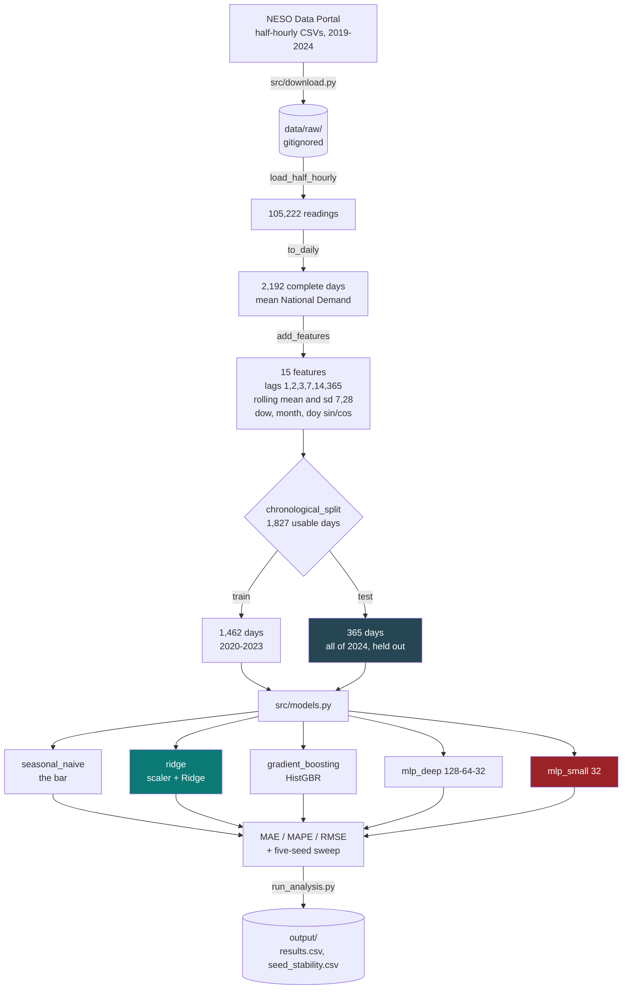

<div align="center">

# Does a Neural Network Actually Help?

### A neural network built properly, benchmarked honestly against simpler models on real GB electricity demand, and reported losing

[](https://github.com/jumma786/demand-forecast-neural-network/actions/workflows/tests.yml)
[](#test-coverage)
[](tests/test_pipeline.py)
[](#environment-matrix)
[](https://scikit-learn.org/)
[](https://www.neso.energy/data-portal/historic-demand-data)
[](https://docs.astral.sh/ruff/)

**A ridge regression wins. The result is published anyway, because that is the point.**

</div>

---

> [!IMPORTANT]
> Most portfolio projects show a neural network succeeding. This one shows what
> happens when you give it a fair fight against a linear baseline and a naive
> benchmark on 1,462 rows of a strongly autoregressive series. **Ridge beats it,
> and the smaller network fails outright.** Both outcomes are pinned by tests so
> they cannot quietly disappear.

## Highlights

| | What it does | Why it matters |
|---|---|---|
| **Honest benchmark** | Five models on identical features and identical splits | The comparison is the deliverable, not the winner |
| **The naive bar is set first** | Seasonal naive (last week, same weekday) at 1,689 MAE | A model that cannot beat this has earned nothing |
| **A documented failure** | The 32-unit MLP lands at **8,258 MAE**, eight times worse than ridge | It is a target-scaling effect, explained rather than patched away before the table was printed |
| **Seed stability sweep** | Five seeds, everything else identical | The MLPs are the **only** models whose score moves; the others sit at `1e-13`, which is floating-point noise |
| **Leakage guards, tested** | Rolling windows shifted before they apply; lag alignment asserted against the raw series | The failure mode that makes a forecast look brilliant and be worthless |
| **The whole of 2024 held out** | Chronological split, asserted in a test | No shuffled split, so no future leaking backwards |
| **Missing driver named** | No temperature covariate, stated up front | Temperature is the largest known omitted driver of demand |
| **Verified in CI** | 14 tests, 79% coverage, Python 3.11 and 3.12 | Every figure on this page is reproducible from a clean checkout |

## Architecture



## Quickstart

```bash
git clone https://github.com/jumma786/demand-forecast-neural-network.git
cd demand-forecast-neural-network

python -m venv .venv && source .venv/bin/activate
pip install -r requirements.txt

python -m src.download      # fetch the NESO CSVs (~9 MB, not committed)
python run_analysis.py      # benchmark plus the five-seed stability sweep
pytest -q                   # 14 tests
```

On Windows the activate step is `.venv\Scripts\activate`.

> [!NOTE]
> `run_analysis.py` trains four models five times over for the seed sweep, so it
> takes a few minutes. The test suite is around 90 seconds in CI. Neither needs a
> GPU.

> [!TIP]
> The download endpoint **302-redirects**. `urllib` follows redirects by default,
> but if you fetch these by hand, `curl` needs `-L` or you will silently save a
> 1.3 KB HTML page under a `.csv` name. `src/download.py` now rejects any response
> too small to be a real file instead of letting the parser guess at it.

## Environment matrix

| Requirement | Version | Notes |
|---|---|---|
| Python | **3.11 / 3.12** | Both verified in CI on every push |
| `numpy` | `>=1.24` | |
| `pandas` | `>=2.0` | `format="mixed"` date parsing needs 2.x |
| `scikit-learn` | `>=1.3` | `HistGradientBoostingRegressor`, `MLPRegressor` |
| `pytest` | `>=7.0` | The `pythonpath` ini option requires 7.0+ |
| `pytest-cov` | `>=4.0` | Coverage reporting |
| Disk | ~10 MB | Source CSVs under `data/raw/` |
| Network | Once | Only for `src.download`; everything after that is offline |

No API key, no account, no GPU.

## Usage showcase

**Run the whole benchmark.**

```python
from src.data import make_series, add_features, chronological_split, FEATURES
from src.models import run_all

df = add_features(make_series())
train, test = chronological_split(df)          # last 365 days held out

run_all(train, test, FEATURES)
#                model      mae  mape_pct     rmse
# 0              ridge   985.73      3.83  1263.71
# 1  gradient_boosting  1016.25      3.94  1275.94
# 2           mlp_deep  1040.05      4.01  1315.36
# 3     seasonal_naive  1689.37      6.33  2206.61
# 4          mlp_small  8258.17     32.47  9807.49
```

**Confirm the split really is chronological.**

```python
train.index.max() < test.index.min()   # True
len(train), len(test)                  # (1462, 365)
```

**Watch the seed sensitivity for yourself.**

```python
for seed in range(5):
    print(seed, run_all(train, test, FEATURES, seed=seed)
                .set_index("model").loc["mlp_deep", "mae"])
# 0 1018.1   1 1025.2   2 1022.3   3 1060.4   4 1060.8
```

### The result

| Model | MAE (MW) | MAPE | RMSE |
|---|---|---|---|
| **Ridge regression** | **985.7** | **3.83%** | **1,263.7** |
| Gradient boosting | 1,016.3 | 3.94% | 1,275.9 |
| Neural network (128-64-32) | 1,040.1 | 4.01% | 1,315.4 |
| Seasonal naive (last week, same weekday) | 1,689.4 | 6.33% | 2,206.6 |
| Neural network (32) | **8,258.2** | **32.47%** | 9,807.5 |

**A ridge regression wins.** It beats gradient boosting and the deep network, and
all three comfortably beat the seasonal-naive baseline.

The deep network is close, 5.5% worse on MAE, and it clearly learned the
structure. It is simply not the right tool for 1,462 rows of a strongly
autoregressive series once seasonality is encoded as features. That is territory
a penalised linear model is very hard to beat in.

### The small network's failure is instructive, not embarrassing

The 32-unit network lands at **8,258 MAE against ridge's 986**, eight times worse,
with a 32% MAPE.

This is a scaling effect, and worth understanding rather than patching away. The
target is GB demand in megawatts, of order 27,000. Features are standardised; the
target is not. A small network cannot span that output range within its iteration
budget, while ridge and gradient boosting are entirely indifferent to it.

> [!IMPORTANT]
> **Neural networks are sensitive to target scale in a way linear models are not.**
> That is a real cost of choosing one, and it belongs in the comparison instead of
> being quietly fixed before the table is printed. The behaviour is pinned by a
> test that fails if it ever stops being true.

### The part that matters more than the ranking

MAE across five random seeds, everything else identical:

| Model | 0 | 1 | 2 | 3 | 4 | mean | std |
|---|---|---|---|---|---|---|---|
| ridge | 985.7 | 985.7 | 985.7 | 985.7 | 985.7 | 985.7 | **1.3e-13** |
| gradient_boosting | 1,016.3 | 1,016.3 | 1,016.3 | 1,016.3 | 1,016.3 | 1,016.3 | **1.3e-13** |
| mlp_deep | 1,018.1 | 1,025.2 | 1,022.3 | 1,060.4 | 1,060.8 | 1,037.4 | **21.37** |
| seasonal_naive | 1,689.4 | 1,689.4 | 1,689.4 | 1,689.4 | 1,689.4 | 1,689.4 | **0.00** |
| mlp_small | 8,725.0 | 8,425.8 | 9,023.7 | 8,712.7 | 8,960.5 | 8,769.5 | **236.88** |

The three deterministic models return the same number every time. Their `1.3e-13`
is floating-point noise in the standard-deviation calculation, not variation in
the model.

**The neural networks are the only models whose score moves when nothing else
changes.** The deep MLP swings 43 MW across seeds, comparable to its entire 54 MW
deficit against ridge. On a single run it could plausibly appear to beat gradient
boosting, or to lose by twice as much, and the analyst would not know which they
were looking at.

Anyone reporting one MLP run as a result is reporting a sample of size one.

### Guarding against leakage

The failure mode that makes a forecast look brilliant and be worthless:

- **Chronological split only.** Train ends before test begins, asserted in a test.
- **Rolling features are shifted before the window applies**, so a day's own value
  cannot enter its own rolling mean. Checked against a hand-computed value.
- **Lag alignment is asserted against the raw series**, not assumed.
- **Partial days are excluded**, so no artificial dips enter the lags.

## Developer workflow

```bash
pytest -q                                     # 14 tests, ~90s
pytest -q --cov=src --cov-report=term-missing
ruff check src tests                          # pinned to 0.16.6, same as CI
```

### Continuous integration


Defined in [`.github/workflows/tests.yml`](.github/workflows/tests.yml). Two of
those choices were made the hard way:

- **`ruff` is pinned to an exact version.** The first CI run went red on import
  ordering alone, because the runner installed a newer ruff than the local one. A
  linter that floats can fail a build on a day nobody touched the code.
- **`pythonpath = .` lives in `pytest.ini`, not in the workflow.** CI ran a bare
  `pytest` and could not import `src/`, since only the `python -m` form puts the
  working directory on `sys.path`. Fixing it in config means a contributor
  cloning this gets the working path too.

### Test coverage

| Module | Coverage | |
|---|---|---|
| `src/models.py` | **100%** | Every model, both metrics paths, the full runner |
| `src/data.py` | **98%** | Loading, daily aggregation, features, the split |
| `src/download.py` | **0%** | Network fetch, deliberately not exercised in the suite |
| **TOTAL** | **79%** | Measured in CI on 3.11 and 3.12 |

The 14 tests cover the real-data span and completeness, physical plausibility,
winter-exceeds-summer, chronological and disjoint splits, the rolling-window leak
guard, lag alignment, finite predictions from every model, ridge beating the naive
baseline, **the documented small-MLP scaling failure**, and MLP seed sensitivity.

## Honesty

> [!IMPORTANT]
> The data is real and openly licensed, and the test year is genuinely held out.
> **A 3.83% MAPE here is what these features support on this series, not a claim
> about achievable forecast accuracy in an operational setting.**

The model set is deliberately plain:

- **No weather covariate**, because the NESO demand file carries no temperature,
  and temperature is the largest known omitted driver of electricity demand. A
  production forecast would need it.
- **The 2020 COVID period is left in the training data untouched.**
- **No hyperparameter search.** Each model gets one sensible configuration, so the
  comparison is not confounded by uneven tuning effort.

What transfers is the method: an honest baseline, leakage guards that are tested
rather than asserted, a seed-stability check, and the willingness to publish that
the more sophisticated model lost.

## Layout

```
src/data.py         load NESO half-hourly, aggregate to daily, build features
src/models.py       ridge, two MLPs, gradient boosting, seasonal naive, metrics
src/download.py     fetch the source CSVs, reject non-CSV responses
run_analysis.py     benchmark plus the five-seed stability sweep
tests/              14 tests
output/             results.csv, seed_stability.csv, summary.json
pytest.ini          pythonpath, so a bare `pytest` works
.github/workflows/  CI on 3.11 and 3.12
```

## Roadmap

| | Item | Rationale |
|---|---|---|
| ☐ | Join a temperature series (Met Office or ERA5) | The largest omitted driver; the most likely way for a non-linear model to finally earn its place |
| ☐ | Scale the target as well as the features | Would fix the small MLP; worth adding as a **sixth** model so the failure stays visible rather than being erased |
| ☐ | Rolling-origin evaluation instead of one held-out year | One test year is one draw; a rolling origin would say whether the ranking is stable across years |
| ☐ | Add prediction intervals | A point forecast without an interval is half an answer |
| ☐ | Add a code licence file | The data licence is stated; the code licence is not |

## Contributing

Issues and pull requests are welcome. Before opening a PR:

```bash
ruff check src tests && pytest -q
```

Both must pass. Two tests deliberately assert **weaknesses** of the neural
networks. If a change makes one of them fail, that is a finding worth writing up
in the PR description, not a test to relax.

---

<div align="center">

**Data:** [NESO Historic Demand Data](https://www.neso.energy/data-portal/historic-demand-data), NESO Open Data Licence
<br>
Built by [Jumma Mohammad Teli](https://github.com/jumma786) &middot; [Portfolio](https://jumma786.github.io/portfolio/)

</div>
